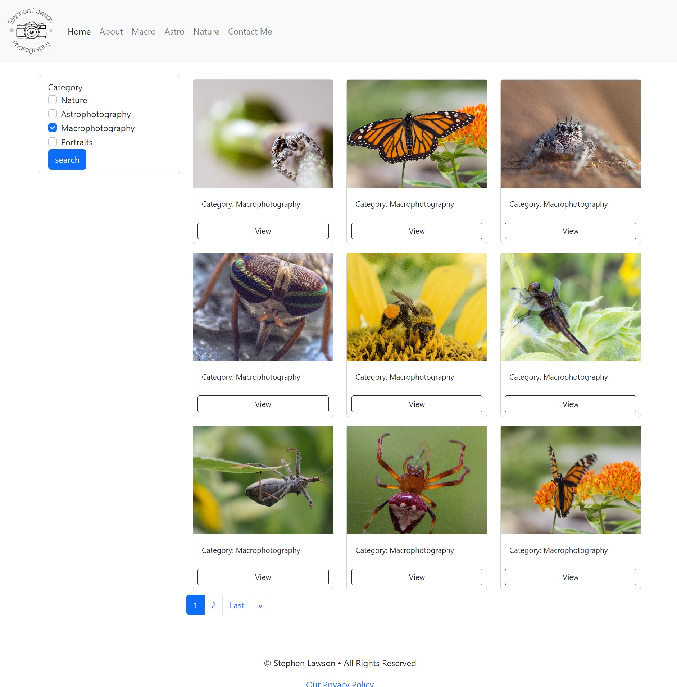
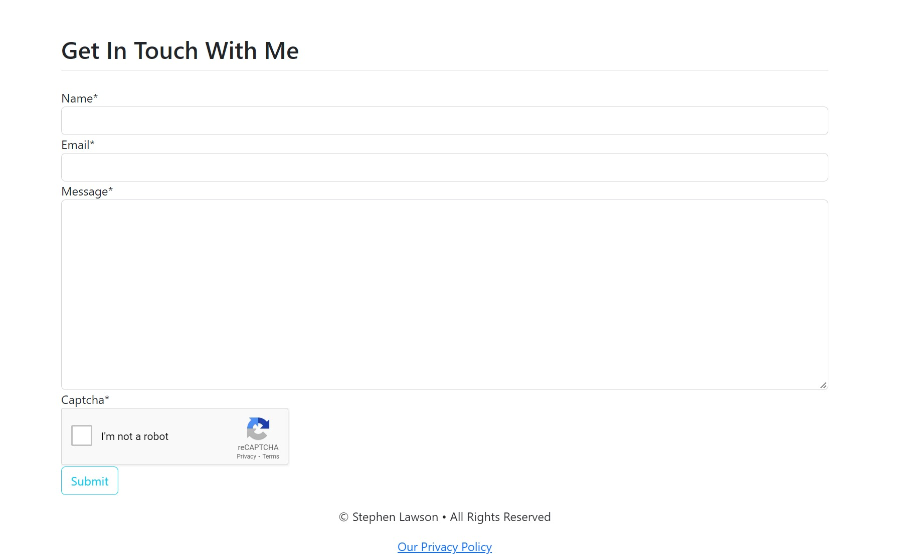
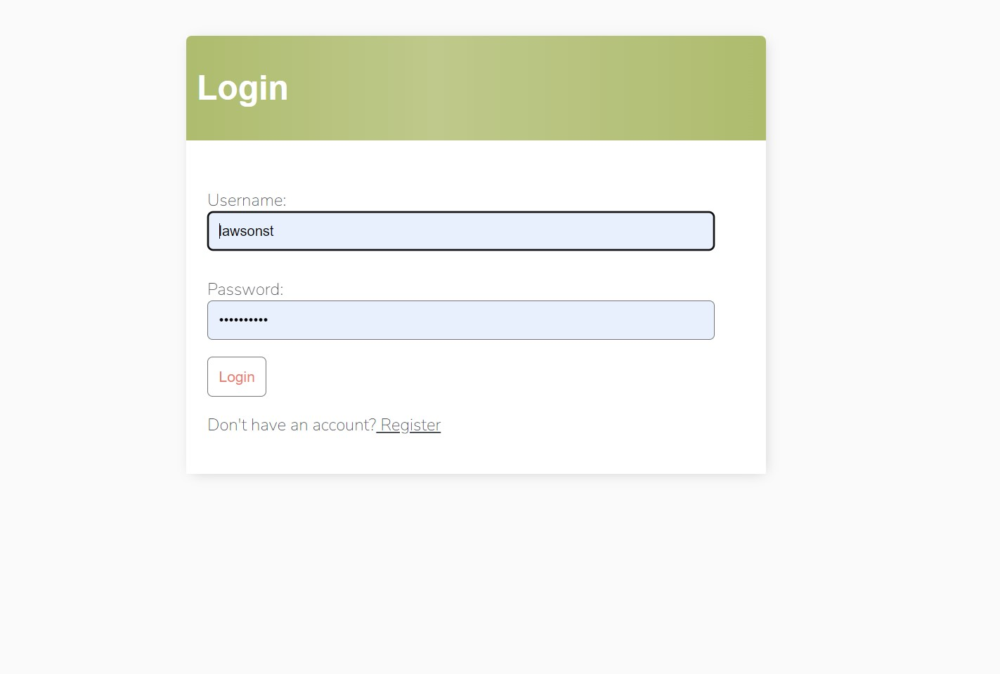
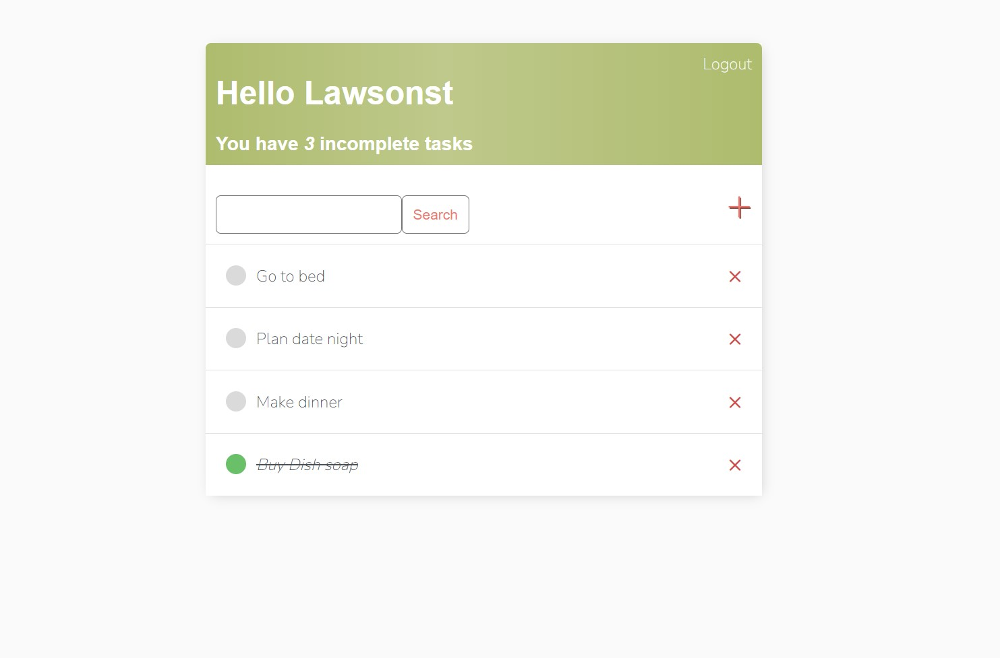
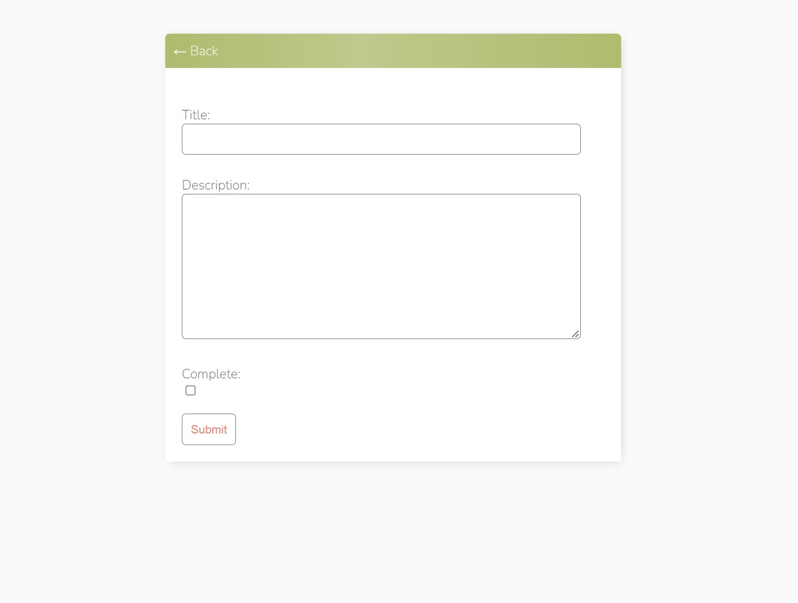
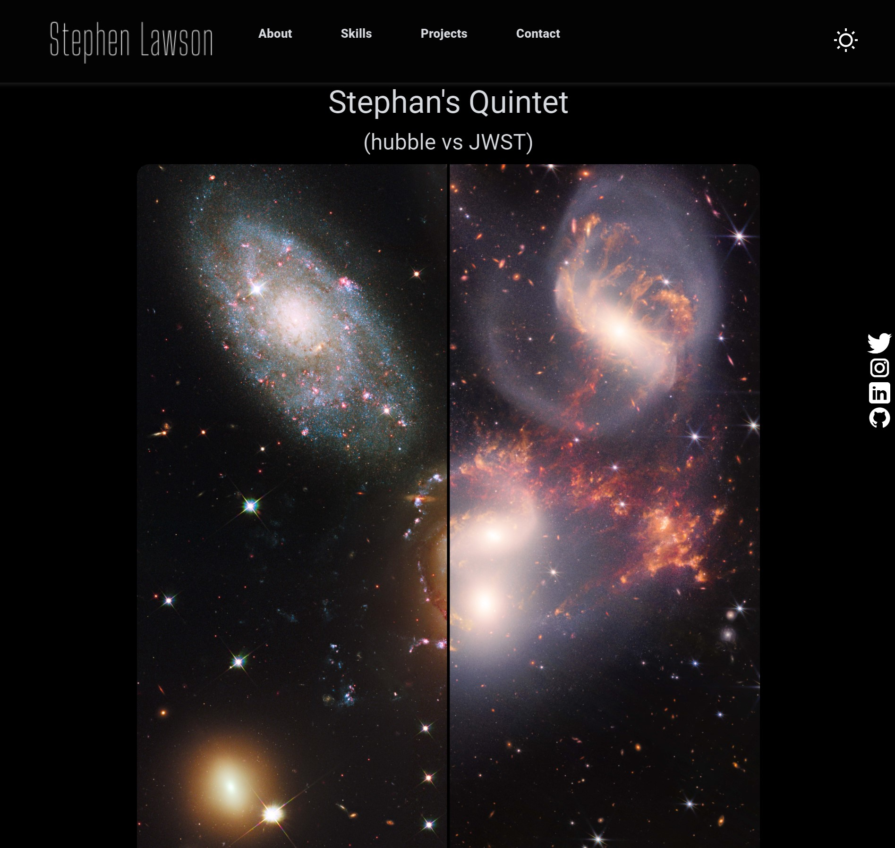
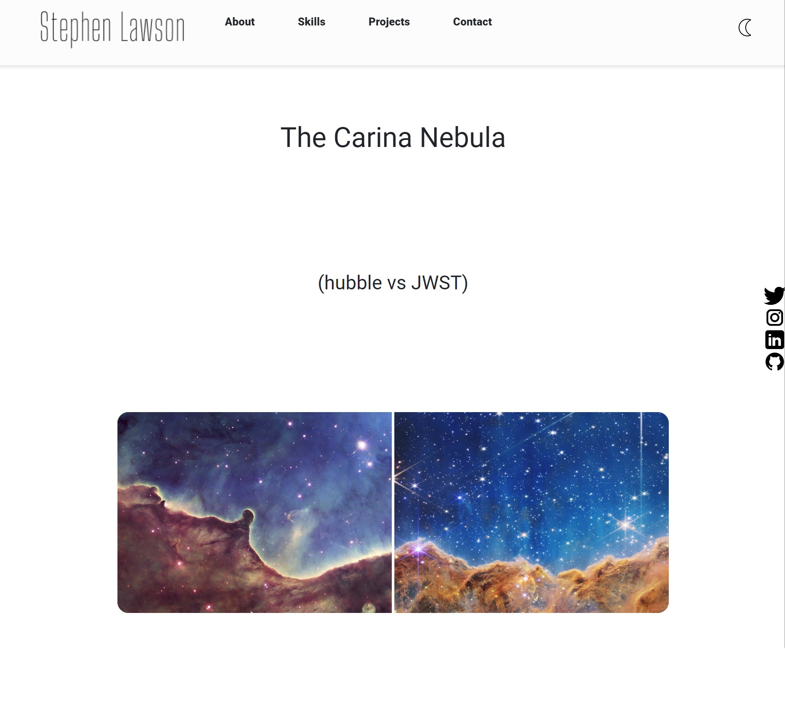

# Portfolio Applications

This was created with the hope of reducing food waste and saving users hundreds of dollars a year. 

## Table of contents

# Photography Portfolio

## Table of contents
- [Photography Portfolio](#photography-portfolio)
-   [Photography Portfolio Overview](#photography-portfolio-overview)
    - [Photography Portfolio Challenge](#photography-portfolio-challenge)
    - [Photography Portfolio Screenshots](#photography-portfolio-screenshots)
    - [Photography Portfolio Link](#photography-portfolio-link)
- [To-Do-List](#to-do-list)
-   [To-Do-List Overview](#to-do-list-overview)
    - [To-Do-List Challenge](#to-do-list-challenge)
    - [To-Do-List screenshots](#to-do-list-screenshots)
    - [To-Do-List Link](#to-do-list-link)
- [JWST-Hubble Slider](#jwst-hubble-slider)
-   [JWST-Hubble Slider Overview](#jwst-hubble-slider-overview)
    - [JWST-Hubble Slider Challenge](#jwst-hubble-slider-challenge)
    - [JWST-Hubble Slider Screenshots](#jwst-hubble-slider-screenshots)
    - [JWST-Hubble Slider Link](#jwst-hubble-slider-link)
- [My process](#my-process)
  - [Built with](#built-with)
  - [What I learned](#what-i-learned)
  - [Continued development](#continued-development)
- [Author](#author)

# Photography Portfolio

## Photography Portfolio Overview

### Photography Portfolio Challenge

I wanted to make a stylish and functional website for my photography. Something that is not only a great place to get in contact with potential clients but also put my work on display for them to view.

### Photography Portfolio Screenshots

### Photography Portfolio Link

- Solution URL: [Photography Portfolio](https://www.stephen.photography/)

# To-Do-List

## To-Do-List Overview

### To-Do-List Challenge

This application was created because I can be very forgetful sometimes. Wit this application users can make their own account and keep track of their own to-do-list. They can create, read, update, and delete items as they wish. They may also mark items as complete but still visible if they wish.

### To-Do-List screenshots

### To-Do-List Link

- Solution URL: [To-Do-List](https://www.stephen.photography/todolist/)

# JWST-Hubble Slider

## JWST-Hubble Slider Overview

### JWST-Hubble Slider Challenge

For this application I wanted to make a great illustration for the differences between the James Webb Space Telescope and the Hubble Space Telescope. A lot of online slider comparison I have seen did not go to the trouble of actually lining up the images, so for this one I did the extra steps of making sure the images were aligned before pushing them to my AWS S3 bucket.

### JWST-Hubble Slider Screenshots

### JWST-Hubble Slider Link

- Solution URL: [Hubble vs JWST Slider](https://www.stephen.photography/hubble-vs-jwst/carina-nebula/)

## My process

The project utilizes Linode to serve webpages, AWS S3 buckets to serve static and images, and AWS RDS to maintain the MySQL database. The HTML and CSS both utilize Bootstrap4 for a simple frontend and a dynamic layout. The backend is handled by Django for organizing models, templates, routing, URLs, and admin functionality. The album categories use JavaScript to dynamically serve the correct category of photography the user is interested in, whether it is nature, astrophotography, macro, or portraiture. The contact form uses reCAPTCHA to verify responses before storing them in the database and sending me an email notification.

### Built with

- AWS S3 Buckets
- AWS RDS
- Linode Ubuntu Server
- MySQL
- Django
- Desktop-first workflow

### What I learned

I learned a lot about the Django web framework and initializing and maintaining a Linux server for this application. There was also a lot I learned about AWS and the many serves it has to offer. Bootstrap was also a big help in making the templating much easier.

### Continued development

I will continue to work on implementing new features, improving the style of the website, maintaining the server, and making the barcode search API more robust.

## Author

- Website - [Portfolio Site](https://www.stephen.photography/portfolio)

