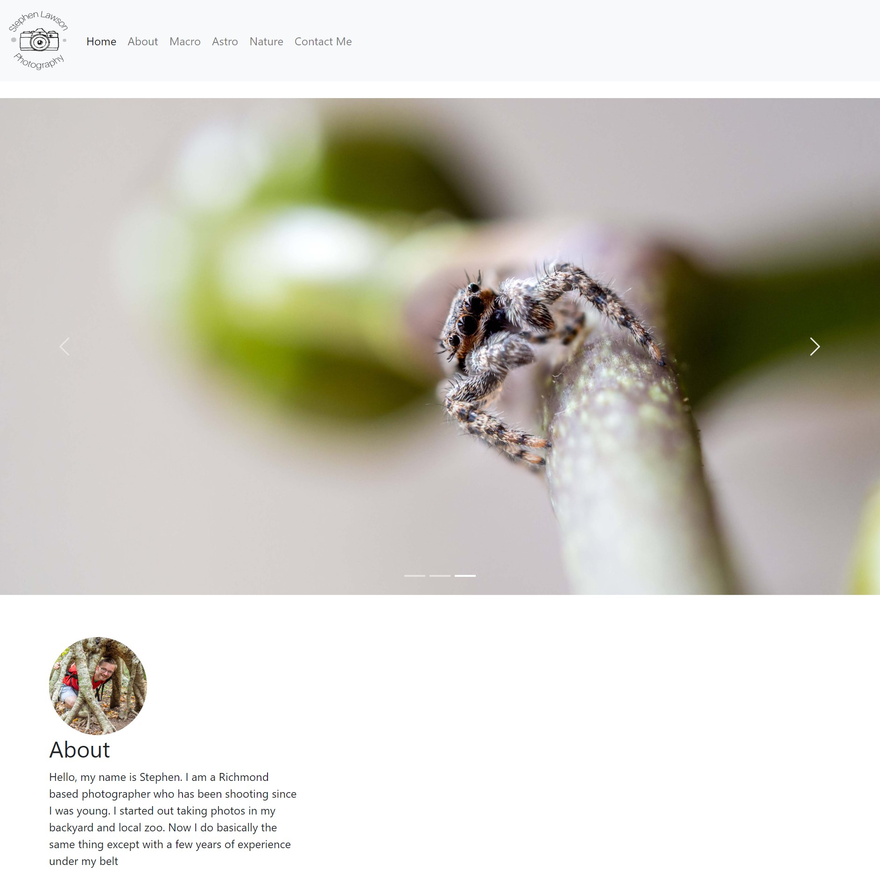

# Portfolio Applications

This was created with the hope of reducing food waste and saving users hundreds of dollars a year. 

## Table of contents

# Photography Portfolio

## Table of contents
- [Photography Portfolio](#photography-portfolio)
-   [Photography Portfolio Overview](#photography-portfolio-overview)
    - [Photography Portfolio Challenge](#photography-portfolio-challenge)
    - [Photography Portfolio Screenshots](#photography-portfolio-screenshots)
    - [Photography Portfolio Link](#photography-portfolio-link)
- [To-Do-List](#to-do-list)
-   [To-Do-List Overview](#to-do-list-overview)
    - [To-Do-List Challenge](#to-do-list-challenge)
    - [To-Do-List screenshots](#to-do-list-screenshots)
    - [To-Do-List Link](#to-do-list-link)
- [JWST-Hubble Slider](#jwst-hubble-slider)
-   [JWST-Hubble Slider Overview](#jwst-hubble-slider-overview)
    - [JWST-Hubble Slider Challenge](#jwst-hubble-slider-challenge)
    - [JWST-Hubble Slider Screenshots](#jwst-hubble-slider-screenshots)
    - [JWST-Hubble Slider Link](#jwst-hubble-slider-link)
- [My process](#my-process)
  - [Built with](#built-with)
  - [What I learned](#what-i-learned)
  - [Continued development](#continued-development)
- [Author](#author)

# Photography Portfolio

## Photography Portfolio Overview

### Photography Portfolio Challenge

I wanted to make a stylish and functional website for my photography. Something that is not only a great place to get in contact with potential clients but also put my work on display for them to view.

### Photography Portfolio Screenshots

### Photography Portfolio Link

- Solution URL: [Food Inventory App](https://www.stephen.photography/)

# To-Do-List

## To-Do-List Overview

### To-Do-List Challenge

I wanted to make a stylish and functional website for my photography. Something that is not only a great place to get in contact with potential clients but also put my work on display for them to view.

### To-Do-List screenshots

### To-Do-List Link

- Solution URL: [Food Inventory App](https://www.stephen.photography/)

# JWST-Hubble Slider

## JWST-Hubble Slider Overview

### JWST-Hubble Slider Challenge

I wanted to make a stylish and functional website for my photography. Something that is not only a great place to get in contact with potential clients but also put my work on display for them to view.

### JWST-Hubble Slider Screenshots

### JWST-Hubble Slider Link

- Solution URL: [Food Inventory App](https://www.stephen.photography/)

## My process

The project utilizes Linode to serve webpages, AWS S3 buckets to serve static and images, and AWS RDS to maintain the MySQL database. The HTML and CSS both utilize Bootstrap4 for a simple frontend and a dynamic layout. The backend is handled by Django for organizing models, templates, routing, URLs, and admin functionality. The album categories use JavaScript to dynamically serve the correct category of photography the user is interested in, whether it is nature, astrophotography, macro, or portraiture. The contact form uses reCAPTCHA to verify responses before storing them in the database and sending me an email notification.

### Built with

- AWS S3 Buckets
- AWS RDS
- Linode Ubuntu Server
- MySQL
- Django
- Desktop-first workflow

### What I learned

I learned a lot about the Django web framework and initializing and maintaining a Linux server for this application. There was also a lot I learned about AWS and the many serves it has to offer. Bootstrap was also a big help in making the templating much easier.

### Continued development

I will continue to work on implementing new features, improving the style of the website, maintaining the server, and making the barcode search API more robust.

## Author

- Website - [Portfolio Site](https://www.stephen.photography/portfolio)

